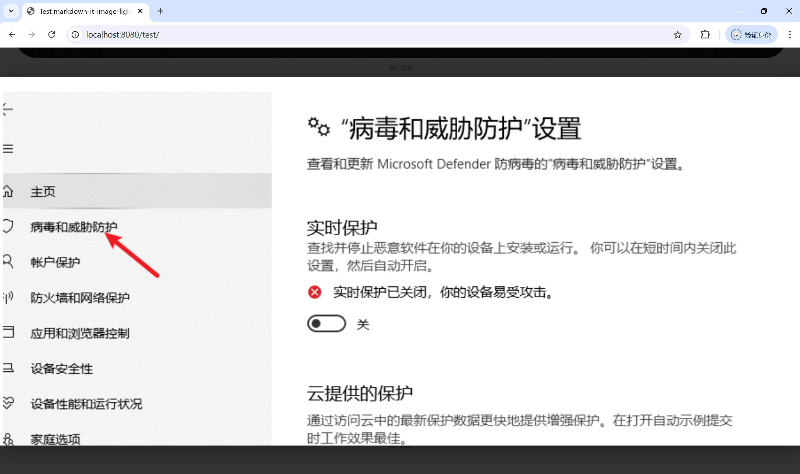

# markdown-it-image-lightbox

The markdown-it-image-lightbox plugin adds **lightbox functionality** to images rendered by markdown-it.

This plugin allows rendered Markdown images to be enlarged and displayed in fullscreen or a pop-up when clicked. It provides a clear, enlarged preview experience when the page layout restricts the full display of the image.

## Installation

```
npm install markdown-it-image-lightbox
```

## Usage

```javascript
import MarkdownIt from 'markdown-it';
import imageLightbox from 'markdown-it-image-lightbox';

const md = new MarkdownIt()

md.use(imageLightbox, {
  mode: 1,                      // Lightbox style
  lazyLoading: true,            // Enable lazy loading
  enableLightbox: true,         // Enable lightbox functionality
  imageClass: 'my-custom-class', // Set CSS class name for content images
  imageRadius: '8px',           // Set border radius for content images
  referrerpolicy: false,        // Whether to set referrerpolicy="no-referrer"
  showCaption: true             // Whether to display image caption (using alt text)
});

const result = md.render('');
```

## Configuration Options

| Option         | Type    | Default Value                       | Description                                                  |
| :------------- | :------ | :---------------------------------- | :----------------------------------------------------------- |
| mode           | number  | 1                                   | Lightbox style. Currently, two styles are available. Please refer to the examples. |
| lazyLoading    | boolean | true                                | Whether to enable image lazy loading, improving initial page load speed. |
| enableLightbox | boolean | true                                | Whether to enable the lightbox functionality (click to enlarge). |
| imageClass     | string  | "markdown-it-image-lightbox-plugin" | Set the CSS class name for content images, facilitating style isolation or customization. |
| imageRadius    | string  | ""                                  | Set the border radius for content images, e.g., "10px".      |
| referrerpolicy | boolean | false                               | If `true`, adds `referrerpolicy="no-referrer"` to the `` tag, preventing referrer URL leakage and potentially helping bypass some hotlink protection strategies (ensure legal and compliant use). |
| showCaption    | boolean | true                                | Whether to display the image caption in the lightbox (uses the `alt` text from Markdown). |

## Example

**mode=1, default style. The lightbox has a close button in the upper right corner of the image, and the image does not fill the entire page.**


**mode=2. The lightbox does not have a close button; clicking the left mouse button closes the lightbox. The image will fill the page as much as possible.**


